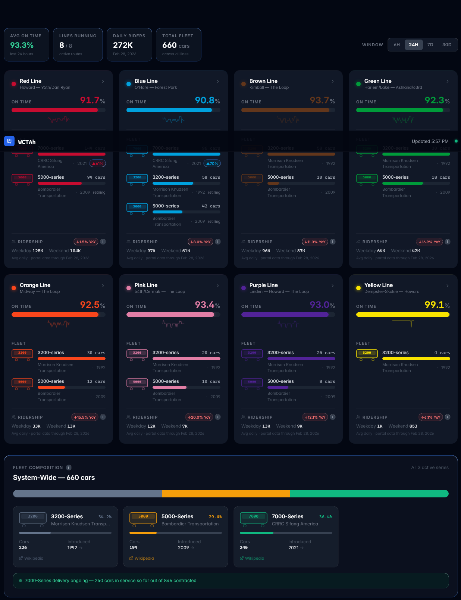
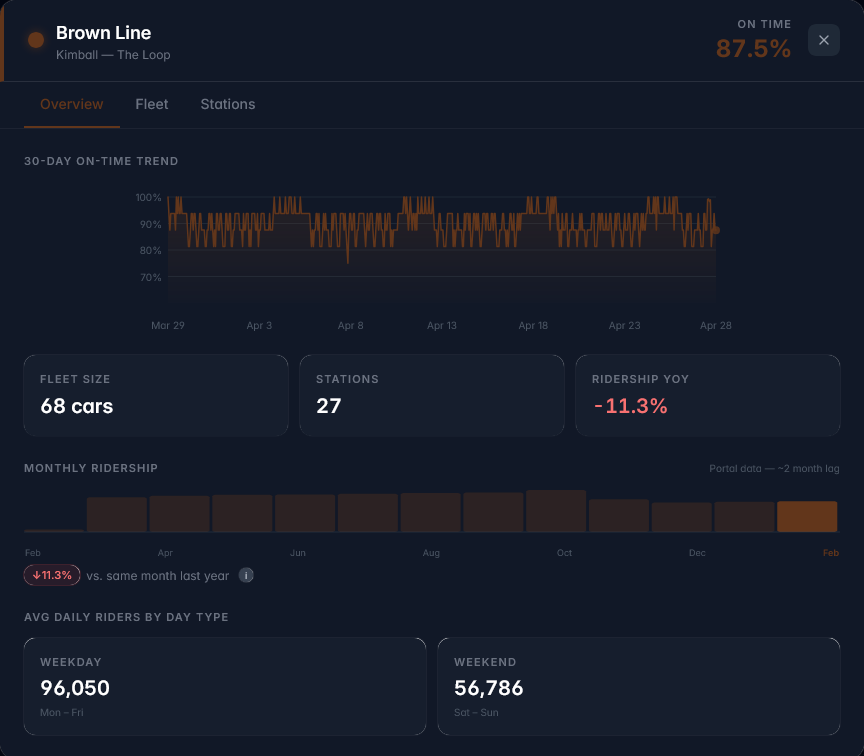
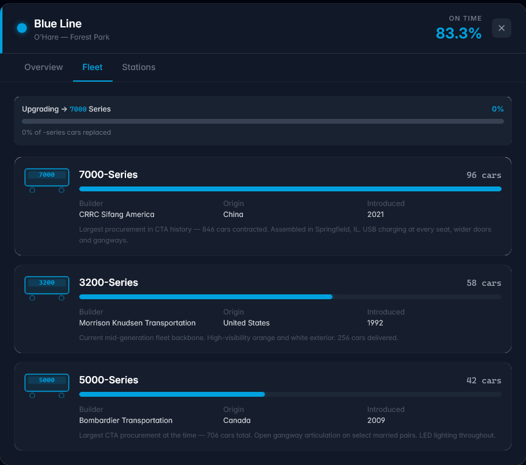
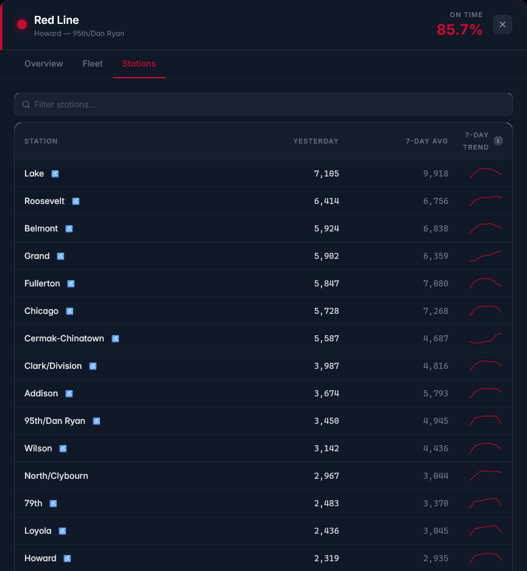

# CTA Watch

A real-time dashboard for Chicago Transit Authority 'L' train performance. Tracks on-time percentage per line, fleet car composition and upgrade progress, station ridership, and historical trends — all in a dark Tailwind UI–styled interface.



| Line detail | Fleet view | Station explorer |
|---|---|---|
|  |  |  |

## Features

- **On-time percentage** per line, polled every 5 minutes during service hours and stored for up to one year of trend history
- **Fleet visualization** — per-series HP bars with `|5|`-style car icons, upgrade progress tracking (e.g. 5000→7000 series, 17% complete)
- **30-day trend charts** with hourly resolution
- **Ridership** — daily totals per line and per station, sourced from Chicago Open Data Portal
- **Station explorer** — filterable station list per line with 7-day ridership sparklines
- **Mock mode** — fully functional without a CTA API key; generates realistic data with rush-hour variance

## Architecture

```
cta-watch/
├── server/     Node.js + Express + SQLite backend
└── client/     Vue 3 + Vite + TailwindCSS frontend
```

The server owns all data fetching, persistence, and scheduled jobs. The client is a pure display layer that polls `/api/lines` every 30 seconds and fetches per-line detail lazily on modal open.

## Quick Start

### Prerequisites

- Node.js 20 or later
- `npm` 9 or later

### Install

```bash
git clone <repo>
cd cta-watch
npm install
```

### Configure

```bash
cp server/.env.example server/.env
```

Edit `server/.env`. At minimum, set `CTA_API_KEY` once you receive it (see below). The server runs in **Mock Mode** automatically when the key is absent — the UI is fully functional without it.

### Run (development)

```bash
npm run dev
```

This starts both the Express server (port **3001**) and the Vite dev server (port **5173**) concurrently. Open `http://localhost:5173`.

On first boot the server:
1. Seeds fleet data and series metadata from `server/src/data/fleet.ts`
2. Fetches station data from the Chicago Open Data Portal (falls back to a hardcoded list if unreachable)
3. Generates 30 days of mock on-time history so trend charts populate immediately
4. Fetches the last 60 days of real ridership data from the Chicago Open Data Portal

### Build (production)

```bash
npm run build
NODE_ENV=production npm start
```

In production mode Express serves the built Vue app as static files — only one process needed.

## Getting a CTA API Key

Register at **https://www.transitchicago.com/developers/traintrackerapiinfo.aspx**

Once approved, add it to `server/.env`:

```
CTA_API_KEY=your_key_here
```

Restart the server. The mock-mode badge in the header will disappear and live data will begin flowing in within 5 minutes.

## Scripts

| Command | Description |
|---------|-------------|
| `npm run dev` | Start server + client in watch mode |
| `npm run build` | Build client for production, compile server TypeScript |
| `npm start` | Start the compiled production server |
| `npm run dev --workspace=server` | Server only |
| `npm run dev --workspace=client` | Client only |

## Tech Stack

| Layer | Technology |
|-------|-----------|
| Frontend | Vue 3, TypeScript, Vite, TailwindCSS v3 |
| Backend | Node.js, Express, TypeScript |
| Database | SQLite via better-sqlite3 |
| Scheduling | node-cron |
| HTTP | axios (server-side CTA/portal fetches) |
| Icons | lucide-vue-next |

## Data Sources

| Source | What it provides | Requires key? |
|--------|-----------------|---------------|
| [CTA Train Tracker API](https://www.transitchicago.com/developers/traintrackerapiinfo.aspx) | Real-time train positions and delay flags | Yes |
| [Chicago Open Data Portal — L Stops](https://data.cityofchicago.org/resource/8pix-ypme.json) | Station names, line assignments, ADA status | No |
| [Chicago Open Data Portal — Daily Ridership](https://data.cityofchicago.org/resource/5neh-572f.json) | Per-station daily entry counts | No |
| `server/src/data/fleet.ts` | Car counts, series metadata, upgrade status | N/A (static) |

## Updating Fleet Data

Fleet composition is static and seeded from `server/src/data/fleet.ts`. To update (e.g. when new 7000-series cars are delivered):

1. Edit the `FLEET_SEED` array in `server/src/data/fleet.ts`
2. POST to the reseed endpoint:
   ```bash
   curl -X POST http://localhost:3001/api/fleet/reseed
   ```

Or PATCH a single line without touching the file:

```bash
curl -X PATCH http://localhost:3001/api/fleet/red \
  -H "Content-Type: application/json" \
  -d '[{"series": 7000, "carCount": 56, "upgradingFrom": 5000, "upgradingTo": null, "upgradePct": 34}]'
```
